# Optimizing Claude Code for Large-Scale SaaS Development from Concept to Deployment

## Executive Summary

A reliable “concept → production” workflow with **Claude Code** works best when you treat the agent as a **bounded implementation and verification engine** that operates inside a rigorously defined operating system of record: **Notion for pre-code decisions**, **GitHub Issues/Projects for executable work**, and **GitHub Actions for gated CI/CD**. This aligns with entity["company","Anthropic","ai company"]’s guidance that Claude Code performs best when it can **verify its work**, and when users separate **exploration → planning → implementation → verification → commit** rather than jumping straight into coding. citeturn7view0turn7view1

The highest-leverage optimizations for large, complex codebases are:

- Make “what to build” unambiguous before you start: capture PRD/tech spec/ADR decisions in entity["company","Notion","productivity software"], then hand off a crisp, testable unit of work to entity["company","GitHub","code hosting platform"] Issues/Projects. citeturn3search13turn0search3turn2search0  
- Keep persistent repo instructions **short** and **actionable** in `CLAUDE.md`; move optional/rare workflows into **skills** so they don’t bloat every session. citeturn7view1turn1search1turn8view0  
- Use **hooks** for non-negotiable, deterministic checks (format/lint/test gates, workflow-edit restrictions), because hooks “guarantee” behavior more reliably than advisory prompt text. citeturn9view0turn8view3  
- Use **subagents** for isolation and context control (test runner, security reviewer, workflow reviewer), and optionally **agent teams** for parallel research/review when it genuinely reduces time-to-answer. citeturn11view0turn8view1turn12view0  
- Harden CI/CD as if the agent is a junior engineer with root access: least-privilege tokens, pinned Actions SHAs, OIDC for cloud auth, protected environments with approvals, and workflow-security review gates. citeturn0search2turn0search16turn2search3turn1search7  

The report below specifies: operating model, exact handoff artifacts and templates, repo layout + `CLAUDE.md` template, skills/subagents with permissions, deterministic hooks, prompting patterns, parallel workflows, QA layers, CI/CD guardrails, metrics/telemetry, risks/mitigations, and a prioritized checklist.

## Operating Model and System of Record

### Operating model

A proven, scalable pattern is a **three-loop system**:

- **Outer loop (product/architecture intent):** Notion holds PRD/RFC/ADR and decision history. Notion explicitly supports PRDs and docs databases for product teams, and recommends PRDs that link out to supporting material. citeturn3search13turn0search3  
- **Middle loop (execution intent):** GitHub Issues/Projects holds decomposed work items with acceptance criteria, ownership, risk, and status. GitHub recommends decomposing work, linking issues and PRs, using metadata fields, and automation in Projects. citeturn2search0turn2search11  
- **Inner loop (implementation & verification):** Claude Code operates on **one bounded Issue (or sub-issue)** at a time; it explores, plans, implements, verifies, then commits/opens a PR. Anthropic’s best practices explicitly recommend “Explore first, then plan, then code,” and emphasize verification as the highest-leverage improvement. citeturn7view0turn7view1  

Claude Code’s own architecture is designed for this: it can read/edit files, run commands, and integrate with tools; it supports persistent instructions via `CLAUDE.md` and optional “auto memory,” plus extensibility via skills, hooks, subagents, MCP, and plugins. citeturn4search19turn1search1turn1search2turn1search0turn11view0turn3search0turn3search14  

### Responsibilities by system

| System | What it should own | What it should *not* own | Why this split scales |
|---|---|---|---|
| Notion | PRD, tech spec/RFC, ADRs, UX flows, non-functional requirements, acceptance criteria rationale | Day-to-day sprint state, CI status, PR review threads | Notion emphasizes connected documentation and PRDs/tech specs as a “system of record” for context and decisions. citeturn3search17turn3search6turn3search13 |
| GitHub Issues/Projects | Work breakdown (Issues/sub-issues), prioritization, sprint/iteration views, PR linkage, status automation | Deep architecture prose, long design debates | GitHub Projects is optimized for tracking work “where issues and PRs live,” encouraging decomposition and metadata automation. citeturn2search0turn2search11turn2search19 |
| `CLAUDE.md` + `.claude/` | Stable repo rules: build/test commands, conventions, invariants, “do not” rules, agent controls (skills/hooks/subagents) | Changing roadmap, release notes, anything that changes daily | `CLAUDE.md` loads every session; Anthropic warns long files dilute adherence. Put optional workflows in skills. citeturn7view1turn1search1turn8view0turn8view2 |
| Claude sessions | One bounded unit: implement + verify + open PR; produce structured summaries; propose follow-up issues | Being the long-term memory of the product; large unscoped multi-epic work in one session | Claude sessions degrade as context fills; best practices highlight aggressive context management and verification loops. citeturn7view0turn1search23 |

### End-to-end workflow diagram

```mermaid
flowchart LR
  A[Concept / Problem] --> B[Notion: PRD + Tech Spec + ADRs]
  B --> C{Ready for Dev?}
  C -- No --> B
  C -- Yes --> D[GitHub Issue: scoped story + AC + links]
  D --> E[Claude Code: Explore]
  E --> F[Claude Code: Plan]
  F --> G[Claude Code: Implement]
  G --> H[Claude Code: Verify locally]
  H --> I[PR opened in GitHub]
  I --> J[CI in GitHub Actions: test + scan + policy]
  J --> K{Merge gate passes?}
  K -- No --> G
  K -- Yes --> L[Merge to main]
  L --> M[Deploy: staging]
  M --> N{Production approval?}
  N -- No --> O[Iterate / Fix]
  N -- Yes --> P[Deploy: production + post-deploy checks]
  P --> Q[Update Notion ADR/Spec if needed]
```



This design intentionally separates **design intent** (Notion), **execution intent** (GitHub), and **implementation work** (Claude inner loop), matching how GitHub Projects and Claude Code are documented to work best. citeturn2search0turn7view0turn3search13turn12view0  

## Artifacts and Handoffs

### Canonical handoff packet from Notion to GitHub

The handoff should be explicit and consistent. A practical “packet” is:

**Notion artifacts (canonical):**
- PRD page (problem, goals, non-goals, outcomes, KPIs, user flows) citeturn3search13  
- Tech spec/RFC page (architecture, API changes, data model, rollout/rollback, risk) citeturn3search6turn3search2  
- ADR(s) for irreversible decisions (auth model, tenancy boundaries, data partitioning)  
- Acceptance criteria written as testable statements (can later be translated into Gherkin, unit tests, or e2e specs)

**GitHub artifacts (execution):**
- One GitHub Issue per deliverable slice (or per story), linked to PRD/spec  
- Sub-issues for parallelizable tasks (GitHub explicitly recommends breaking down issues and using sub-issues to enable parallelism). citeturn2search0turn2search8  
- A GitHub Project item with fields: `Area`, `Service`, `Risk`, `QA level`, `Release train`, `Owner`, `Status`

**Repo artifacts (implementation support):**
- Optional: `docs/` snapshot of the “implementation-ready” subset (API contract, migration plan, interface descriptions). This is not required, but can be helpful for code review and historical traceability.

### Exact handoff mechanics

You have two robust options for moving Notion context into GitHub without flooding Claude’s context window:

**Option A: Link-only + structured Issue fields (recommended default)**  
- GitHub Issue includes:
  - Link to Notion PRD
  - Link to Notion tech spec
  - A **one-paragraph** “Implementation Summary” extracted from the spec
  - Acceptance criteria checklist
  - Verification commands (what CI must pass)
- This keeps the Issue self-contained and minimizes agent context load.

**Option B: Attach an export snapshot when needed**  
Notion can export:
- Non-database pages as **Markdown**
- Full-page databases as **CSV**, plus Markdown files for subpages citeturn3search1  

Use this when:
- You want a frozen copy of a spec for a release branch
- You want to feed a long spec to Claude *outside* of MCP
- You need offline review

### Notion ↔ GitHub mapping table

| Concept | Notion field / page property | GitHub Issue / Project field | Notes |
|---|---|---|---|
| Scope | “Goals / Non-goals” | Issue description + “Out of Scope” section | Reduce hallucination by making “don’t build” explicit. citeturn7view0 |
| Risk | “Risk / Open Questions” | `Risk` (Low/Med/High) + labels (`security`, `migration`) | Use to trigger required reviewers & extra QA. citeturn1search7turn6search4 |
| Acceptance criteria | “AC” checklist | Issue checklist + PR checklist | Use as Stop-hook criteria for Claude. citeturn9view0turn8view3 |
| Rollout plan | “Rollout / Rollback” | `Deployment strategy` field + PR section | Gate production deploy with environments. citeturn1search7turn1search10 |
| Test plan | “Verification” | `QA level` field + “How to verify” in PR | Claude is strongest when verification is explicit. citeturn7view0 |

### GitHub Issue and PR templates

GitHub supports Issue templates (Markdown or forms) via `.github/ISSUE_TEMPLATE/`, configured with `config.yml`. citeturn2search1turn2search5turn2search9  
GitHub supports PR templates via `.github/pull_request_template.md` and related locations. citeturn2search2  

Below are **Markdown templates** (as requested). They are designed to be “Claude-ready” (clear scope, explicit verification, strong constraints).

#### `.github/ISSUE_TEMPLATE/feature.md`

```markdown
---
name: Feature
about: Deliver a user-visible feature or capability.
title: "[Feature] "
labels: ["feature"]
assignees: []
---

## Summary
What are we building? One paragraph.

## User value / problem
Why does this matter? Who benefits?

## Scope
### In scope
- 

### Out of scope
- 

## Acceptance criteria
- [ ] 
- [ ] 

## UX / API / Data notes
- Notion PRD: 
- Notion Tech Spec: 
- ADRs: 

## Constraints / invariants
- Tenancy boundary rules:
- Backward compatibility requirements:
- Performance/SLO requirements:

## Verification
### Local
- [ ] `...` (command)
- [ ] `...`

### CI expectations
- [ ] Unit tests
- [ ] Integration tests
- [ ] Security scans (if applicable)

## Rollout / rollback notes
- Feature flag? (yes/no)
- Migration required? (yes/no)
- Rollback plan:
```

#### `.github/ISSUE_TEMPLATE/bug.md`

```markdown
---
name: Bug report
about: Something is broken; requires fix with regression coverage.
title: "[Bug] "
labels: ["bug"]
assignees: []
---

## Symptom
What is happening vs what should happen?

## Impact
Who is affected? Severity? Frequency?

## Reproduction steps
1.
2.
3.

## Expected behavior
Describe the correct behavior.

## Suspected area
Paths/files/services if known.

## Logs / screenshots
Paste minimal relevant excerpts or attach.

## Acceptance criteria
- [ ] Add regression test that fails before fix and passes after
- [ ] Fix root cause (not symptom suppression)
- [ ] Verify with commands below

## Verification commands
- [ ] `...`
- [ ] `...`
```

#### `.github/ISSUE_TEMPLATE/tech-debt.md`

```markdown
---
name: Tech debt / refactor
about: Refactor, cleanup, performance, maintainability work.
title: "[TechDebt] "
labels: ["tech-debt"]
assignees: []
---

## Motivation
Why now? What risk or cost does this reduce?

## Target outcome
What will be different when done?

## Non-goals
What are we explicitly not changing?

## Constraints
Backward compatibility, APIs, migrations, performance.

## Acceptance criteria
- [ ] No behavior change (unless explicitly stated)
- [ ] Tests updated/added to preserve behavior
- [ ] Performance not worse (add benchmark if needed)

## Verification
- [ ] `...`
```

#### `.github/pull_request_template.md`

```markdown
## What
Concise description of what this PR does.

## Why
User value and/or engineering reason.

## Linked work
- Issue: #
- Notion PRD:
- Notion Tech Spec:
- ADRs:

## Scope
### In scope
- 

### Out of scope
- 

## How it works
A short explanation + notes on risky areas.

## How to verify
### Local
- `...`

### Tests added/updated
- [ ] Unit
- [ ] Integration
- [ ] E2E
- [ ] Visual (if UI)

## Rollout plan
- Feature flag:
- Migration:
- Staging validation:
- Production steps:

## Security / privacy checklist
- [ ] No secrets in code/logs
- [ ] Input validation for new endpoints
- [ ] AuthZ checked for tenant boundaries
- [ ] Least-privilege changes only

## Screenshots / logs (if applicable)
Attach evidence.
```

These templates complement the approach GitHub documents (templates in `.github/` directories) and reinforce work decomposition and communication. citeturn2search2turn2search1turn2search0  

## Repo Harness and Agent Configuration

### Repo layout

Claude Code reads configuration from the project `.claude/` directory plus project/root `CLAUDE.md`, while also supporting user-level config in `~/.claude`. The docs provide a reference map for what lives where, what’s committed, and what loads at startup. citeturn8view2turn1search19  

A layout that works well for complex SaaS:

```text
.
├─ CLAUDE.md
├─ .claude/
│  ├─ settings.json
│  ├─ skills/
│  │  ├─ fix-issue/SKILL.md
│  │  ├─ pr-ready/SKILL.md
│  │  ├─ qa-sweep/SKILL.md
│  │  └─ actions-review/SKILL.md
│  ├─ agents/
│  │  ├─ code-reviewer.md
│  │  ├─ security-reviewer.md
│  │  ├─ test-runner.md
│  │  └─ workflow-guardian.md
│  └─ rules/
│     ├─ backend.md
│     ├─ frontend.md
│     └─ migrations.md
├─ .github/
│  ├─ ISSUE_TEMPLATE/
│  ├─ workflows/
│  └─ CODEOWNERS
└─ docs/
   ├─ architecture/
   └─ adr/
```

Notes:
- `.claude/rules/` is useful for path- or type-scoped instructions (so you don’t bloat `CLAUDE.md`). citeturn1search1turn8view2  
- `.mcp.json` can hold team-shared MCP server configurations for external tools, per the `.claude` directory reference. citeturn8view2turn3search0  

### `CLAUDE.md` content and a concise template

Claude Code loads `CLAUDE.md` at the start of every session. Anthropic recommends keeping it short, focused on commands/invariants/workflow rules that Claude cannot infer, and moving optional content into skills. citeturn7view1turn1search1turn8view0  

A concise template (edit placeholders):

```markdown
# Project invariants (do not violate)
- Multi-tenant isolation: never read/write another tenant's data without explicit admin-only flow.
- Backward compatibility: additive-only public API changes unless the issue explicitly approves breaking changes.
- Migrations: avoid destructive schema changes; use expand/contract with safe rollouts.

# репо navigation
- Monorepo? (yes/no): <describe key packages/services briefly>
- Primary service entrypoints: <paths>
- Where configs live: <paths>

# Build / test / lint (preferred)
- Install: <command>
- Lint: <command>
- Typecheck: <command>
- Unit tests: <command> (prefer targeted tests)
- Integration tests: <command>
- E2E tests: <command>
- Local dev: <command>

# Git workflow
- Branch naming: feature/<slug> | fix/<slug> | chore/<slug>
- Always open a PR; never push directly to protected branches.
- PR title format: <convention>
- Always update tests for behavior changes; add regression tests for bugs.

# Verification rules (IMPORTANT)
- After code changes: run lint + unit tests for affected package(s).
- Before PR: include "How to verify" steps and evidence (logs/screenshots when relevant).
- Never disable security checks or CI gates without explicit instruction in the issue.

# Where to find design intent
- Notion PRD link is always in the GitHub Issue.
- If details are missing, stop and ask for the Notion link or clarifications.
```

If your repo is large, keep `CLAUDE.md` minimal and move detailed conventions into `.claude/rules/*.md` or skills, consistent with how Claude Code memory and rule scoping are documented. citeturn1search1turn8view2turn8view0  

### Skills to create

Skills are loaded on demand (full content) while their descriptions help discoverability; they’re created as `.claude/skills/<name>/SKILL.md` with YAML frontmatter. Skills support `disable-model-invocation`, tool restrictions, argument passing, and dynamic context injection. citeturn8view0turn10view1turn10view3  

A focused skill set for SaaS delivery:

| Skill name | Purpose | Inputs | Outputs | Suggested `allowed-tools` / controls |
|---|---|---|---|---|
| `fix-issue` | Implement one GitHub Issue end-to-end (explore → plan → implement → verify → PR) | Issue number/link, constraints | PR + summary + verification evidence | `disable-model-invocation: true`; allow `Read/Grep/Glob/Bash(gh *)/Write/Edit` as needed citeturn10view1turn7view0 |
| `qa-sweep` | Run relevant test suite(s) and summarize failures only | Target package/service | Failure summary + next actions | Run in a subagent; allow `Bash` + read-only; keep verbose output isolated citeturn8view1turn11view0 |
| `pr-ready` | Ensure PR meets template + DoD; fill PR template sections | PR branch | PR description + checklist completion | Strictly read-only + `Bash(gh *)`; `disable-model-invocation: true` |
| `actions-review` | Review workflow changes for least privilege, pinning, risky triggers | Diff of `.github/workflows` | Findings + recommended patch | Read-only tools; optionally a dedicated subagent |
| `migration-safe` | Generate expand/contract migration plan + checks | Proposed schema changes | Stepwise migration + rollback plan | Read-only + limited file writes under `migrations/` only |

Example minimal skill file for `/fix-issue`:

```markdown
---
name: fix-issue
description: Implement a single GitHub issue end-to-end with tests and a PR.
disable-model-invocation: true
allowed-tools: Read Glob Grep Bash(gh *) Bash(git *) Write Edit
---
Fix GitHub issue $ARGUMENTS.

Process:
1) Explore: read relevant code paths; summarize current behavior.
2) Plan: propose a stepwise plan and list verification commands. Wait for approval.
3) Implement: change minimal code to satisfy acceptance criteria.
4) Verify: run lint/tests; capture results.
5) PR: open a PR with the PR template filled, include how-to-verify steps.
```

This matches the documented skill frontmatter pattern and argument passing mechanism. citeturn10view1turn10view3  

### Subagents to create

Subagents are markdown files with YAML frontmatter in `.claude/agents/` (project scope) or `~/.claude/agents/` (user scope). They can limit tools, choose models, run in background, and isolate high-output operations like test runs. citeturn11view0turn8view1  

A practical subagent suite for large SaaS:

| Subagent name | Purpose | Typical tasks | Inputs | Outputs | Recommended tools/permissions |
|---|---|---|---|---|---|
| `code-reviewer` | Adversarial code review without author bias | Logic errors, edge cases, regressions | PR diff / files | Review comments + risk flags | Read-only tools (`Read/Grep/Glob`); no write |
| `security-reviewer` | AuthZ, injection, secrets, tenancy boundaries | Endpoint review, data access checks | Diff + architecture notes | Security findings + mitigations | Read-only + optional `Bash` for grep/search |
| `test-runner` | Run tests and return minimal failure info | Unit/integration/e2e runs | Commands | Failing tests + logs excerpt | `Bash` only; keep output isolated per subagent guidance citeturn8view1turn11view0 |
| `workflow-guardian` | Review GitHub Actions diffs and token perms | Workflow security posture | Workflow YAML diff | Required fixes + rationale | Read-only + `Bash` for local linters |
| `migration-reviewer` | Backward compatibility + expand/contract | Schema changes | Migration diff | Stepwise rollout/rollback plan | Read-only + strict path gating rules |
| `release-manager` | Staging→prod checklist enforcement | Release readiness checks | Release notes + CI status | Go/no-go summary | `Bash(gh *)` read-only; no code writes |

Subagent file example (`.claude/agents/workflow-guardian.md`):

```markdown
---
name: workflow-guardian
description: Reviews GitHub Actions workflow changes for security, least privilege, pinning, and risky triggers.
tools: Read, Glob, Grep, Bash
model: sonnet
---
You are a CI/CD security reviewer.

Check:
- GITHUB_TOKEN permissions are least-privilege (job-level where possible).
- Third-party actions are pinned to full commit SHAs.
- Workflows avoid dangerous patterns (e.g., privileged runs on untrusted PR code).
- Environments and approvals for production are correctly configured.
Return a prioritized list of findings and propose minimal patches.
```

This format matches the documented subagent file structure and frontmatter requirements. citeturn11view0  

### Hooks for deterministic enforcement

Hooks are designed specifically to enforce actions that must occur every time (formatting, blocking protected edits, audit logs). The hooks guide includes examples and emphasizes deterministic control compared to advisory instructions. citeturn9view0turn8view3  

Recommended hooks for complex SaaS work:

- **PostToolUse → auto-format** (run formatter after edits)  
- **PreToolUse → block unauthorized writes** (migrations, `.github/workflows`, secrets files)  
- **Stop → completeness check** (ensure acceptance criteria + verification evidence exists before “done”)  
- **ConfigChange / InstructionsLoaded → audit changes** (detect accidental loosening of permissions)  
- **TeammateIdle / TaskCompleted** (if using agent teams) to enforce quality gates before a teammate “finishes” citeturn12view0turn8view3turn9view0  

Minimal example snippets (place in `.claude/settings.json` for project-level sharing, per the hooks guide’s examples): citeturn9view0turn8view2  

```json
{
  "hooks": {
    "PostToolUse": [
      {
        "matcher": "Edit|Write",
        "hooks": [
          {
            "type": "command",
            "command": "scripts/format-touched-files.sh"
          }
        ]
      }
    ],
    "PreToolUse": [
      {
        "matcher": "Write|Edit",
        "hooks": [
          {
            "type": "command",
            "command": "scripts/block-protected-paths.sh"
          }
        ]
      }
    ],
    "Stop": [
      {
        "hooks": [
          {
            "type": "prompt",
            "prompt": "Check if the acceptance criteria and verification steps in the GitHub Issue are fully met and evidenced in the PR description. If not, return {\"ok\": false, \"reason\": \"what remains\"}."
          }
        ]
      }
    ]
  }
}
```

This mirrors the hooks guide patterns (Notification, PostToolUse formatting, prompt-based Stop checks) and the hooks reference event model. citeturn9view0turn8view3  

### Prompting patterns that scale

Anthropic’s best practices recommend:

- Always give Claude a way to verify its work (tests, screenshots, expected output) citeturn7view0  
- Separate Explore → Plan → Implement → Verify/Commit citeturn7view0  
- Use `@` file references, and prefer CLI tools like `gh` for GitHub interactions citeturn7view1  

A repeatable prompt skeleton:

1) **Explore (Plan Mode)**  
“Enter Plan Mode. Read the Issue #123 and the linked Notion spec. Identify affected modules and existing patterns. Summarize current behavior and risks. Do not change code yet.”

2) **Plan**  
“Propose a step-by-step plan. Include: file list, test strategy (unit/integration/e2e), migration/rollout notes, and verification commands. Wait for approval.”

3) **Implement**  
“Implement steps 1–2 only. Add tests first where possible. Keep changes minimal and aligned to existing patterns.”

4) **Verify**  
“Run: lint + unit tests for affected package + integration tests if required. If failures occur, iterate until green. Summarize results.”

5) **Commit/PR**  
“Commit with a descriptive message and open a PR. Fill the PR template, including how-to-verify steps and rollout plan.”  

This directly reflects the documented four-phase workflow (Explore/Plan/Code/Commit) and verification emphasis. citeturn7view0turn7view1  

### Parallel-session review workflows

There are three supported parallelism levels:

- **Subagents inside a session**: good for isolating verbose operations and keeping your main context clean. citeturn8view1turn11view0  
- **Manual parallel Claude sessions**: effective when you want independent review posture without coordination overhead (also recommended in best practices as “run multiple sessions”). citeturn7view0  
- **Agent teams (experimental)**: formal, coordinated parallelism with a lead + teammates, when workloads are naturally separable; includes hooks for `TaskCompleted`/`TeammateIdle` quality gates. citeturn12view0  

A high-signal review pattern for production PRs:

- Session A (implementer): `/fix-issue 123`
- Session B (reviewer): run `code-reviewer` on the diff; focus on edge cases
- Session C (security): run `security-reviewer` on authZ/tenancy paths
- Session D (CI): run `test-runner` to execute the full relevant matrix and summarize only failures

This reduces shared-context bias and aligns with Claude Code’s explicit guidance on subagents/teams for isolation and parallel work. citeturn11view0turn12view0turn7view0  

### GitHub integration patterns

For interactive GitHub work, Anthropic recommends CLI tools like `gh` for efficient external-service interaction and notes Claude can use it for Issues/PRs. citeturn7view1turn0search25  
For automation, Claude Code GitHub Actions supports triggering via `@claude` on Issues/PRs and aims to follow your `CLAUDE.md`. citeturn0search1turn0search5turn0search12  

A conservative stance for large SaaS: use the Action for **bounded** tasks (triage, small fixes, doc updates, test scaffolding), while forcing human review and strong policy gates for workflows, infra, secrets, and migrations.

## QA, CI/CD Guardrails, and Deployment Process

### QA layers and test strategy

A scalable test strategy typically follows a “balanced pyramid”: many unit tests, fewer integration tests, and a small number of end-to-end tests at the top. This is the core idea behind the Test Pyramid literature. citeturn5search4turn5search0  

A practical SaaS test stack:

- **Static checks (fast gate):** lint, typecheck, formatting, dependency checks  
- **Unit tests (fast):** business logic, pure functions, permission checks  
- **Integration tests (medium):** DB + service boundaries, message queues, cache behavior  
- **E2E tests (slower):** key user journeys  
- **Visual tests (UI):** screenshot comparisons to catch unintended UI regressions (supported by Playwright and Cypress ecosystems) citeturn5search1turn5search2  
- **Migration safety tests:** enforce phased expand/contract plan, plus rollback assertions; expand/contract is a widely documented approach for safe persistent-data changes citeturn5search3turn5search7  

Important for Claude Code: verification should be explicit, because “Claude performs dramatically better when it can verify its own work.” citeturn7view0  

### GitHub Actions guardrails

Key GitHub Actions hardening rules (strongly supported by GitHub documentation):

- **Pin third-party actions by full commit SHA** to make dependencies immutable and reduce supply-chain risk. citeturn0search2  
- **Least privilege for `GITHUB_TOKEN`** and explicitly set permissions, rather than relying on broad defaults. citeturn0search16turn0search13  
- **Restrict which actions can run** via repository/org policies (reduce the “unknown action” attack surface). citeturn4search5  
- **Prefer OIDC to long-lived cloud secrets** for deployments (short-lived credentials, no stored keys). citeturn2search3turn2search14  
- **Use protected environments with deployment protection rules** (required reviewers, wait timers, branch restrictions) for production. citeturn1search7turn1search10turn1search3  

Additional high-value guardrails (reputable security research/community guidance):
- Treat privileged triggers such as `pull_request_target` as risky unless you fully understand the trust boundary; GitHub’s own security guidance warns about `pull_request_target` used with untrusted code, and industry research documents exploitation patterns (“pwn request”). citeturn4search28turn4search8turn4search31  

### Workflow review process

For a large SaaS, workflow changes should be treated like production infrastructure changes:

- Add `CODEOWNERS` entries for `.github/workflows/**` so workflow changes trigger review requests from a DevOps/security owner. GitHub documents CODEOWNERS behavior and review requests based on base-branch CODEOWNERS. citeturn6search1  
- Protect main/release branches with branch protection rules requiring status checks and approvals. citeturn6search0turn6search4  
- Consider rulesets and required status check sources to prevent spoofed checks. citeturn6search8  
- Add secret scanning + push protection to prevent credential leaks. citeturn6search7turn6search3  
- Enable Dependabot (alerts, security updates, version updates) to keep dependencies and GitHub Actions updated. citeturn6search24turn6search6turn6search17  

### CI gating and deployment approvals

GitHub environments support deployment protection rules such as required reviewers; documentation explains how jobs referencing an environment can be held pending approval and how reviews work. citeturn1search7turn1search10  
GitHub also introduced controls like preventing self-reviews for required reviewers in environments to strengthen deployment approvals. citeturn1search24  

A practical gate model:

- PR gate: lint + unit + integration + code scanning + workflow scanning (if workflow changed)  
- Merge gate: branch protection requires checks and reviews  
- Deploy gate (staging): automatic on main merge  
- Deploy gate (production): environment approval + change window checks + post-deploy smoke tests

#### CI/CD gating diagram

```mermaid
flowchart TB
  PR[Pull Request Open/Update] --> CI1[CI: lint + typecheck]
  PR --> CI2[CI: unit tests]
  PR --> CI3[CI: integration tests]
  PR --> SEC1[Code scanning (CodeQL) + dependency checks]
  PR --> WF1[Workflow policy checks if .github/workflows changed]

  CI1 --> G{All required checks pass?}
  CI2 --> G
  CI3 --> G
  SEC1 --> G
  WF1 --> G

  G -- No --> PR
  G -- Yes --> R[Required reviews + CODEOWNERS]
  R --> M{Merge allowed?}
  M -- No --> PR
  M -- Yes --> MAIN[Merge to main]

  MAIN --> STG[Deploy to staging]
  STG --> SMOKE[Post-deploy smoke tests]
  SMOKE --> PRODAPP{Production environment approval}
  PRODAPP -- Reject --> HOTFIX[Create fix issue/PR]
  PRODAPP -- Approve --> PROD[Deploy to production]
  PROD --> MON[Monitor + rollback if needed]
```

### Security scanning and code quality gates

GitHub’s CodeQL-based code scanning runs on PRs and reports results as alerts/checks in PR contexts (configurable), and GitHub provides documentation on code scanning behavior and PR annotations. citeturn4search6turn4search3turn4search13  
GitHub also introduced CodeQL packs to scan GitHub Actions workflows themselves via code scanning. citeturn4search32  

These complement Claude review automation (Claude Code “Code Review” features) when you want an additional agent-based lens; Claude Code docs describe PR review with inline findings and severity tagging. citeturn4search14  

## Metrics, Risks, and Implementation Checklist

### Metrics and telemetry

Claude Code provides:
- **Analytics dashboards** for usage/adoption and contribution metrics citeturn4search0  
- **Monitoring exports via OpenTelemetry** (metrics/logs/traces) to track tool activity, costs, and usage patterns citeturn4search4  
- Guidance on costs/context management and token usage controls for organizations citeturn4search10turn1search23  

A useful metrics set for “agent + engineering quality”:

| Category | Metric | Source |
|---|---|---|
| Delivery speed | Lead time (Issue → merged), cycle time (PR open → merged) | GitHub PR/Issue timestamps |
| CI health | Build success rate, mean time to green, flaky test rate | GitHub Actions runs |
| Quality | Bug escape rate (prod incidents per release), rollback frequency | Incident tracking + deploy logs |
| Test portfolio | Unit/integration/e2e counts, coverage trends | Test tooling + CI artifacts |
| Security | Code scanning alerts (open/closed), secret scanning incidents, Dependabot MTTR | GitHub security features citeturn4search6turn6search7turn6search24 |
| Agent effectiveness | “First-pass green” rate, number of tool calls per issue, tokens per merged PR, hook denials per PR | Claude Code analytics/OTel + hooks logs citeturn4search0turn4search4turn8view3 |
| Scope quality | Reopened issues due to unclear AC, clarification requests per issue | GitHub issue analytics |

### Key risks and mitigations

**Context window saturation (quality degradation)**  
- Risk: Long sessions cause forgetting and increased mistakes; Anthropic explicitly notes context fills quickly and performance degrades. citeturn7view0turn1search23  
- Mitigation: short `CLAUDE.md`; move optional content to skills; use subagents for verbose operations; use `/context` and `/memory` to inspect what loaded. citeturn1search23turn1search1turn8view1turn8view2  

**Hallucination / “trust-then-verify” gap**  
- Risk: plausible code that fails edge cases. Best practices flag this explicitly and recommend verification criteria. citeturn7view0turn7view1  
- Mitigation: require tests, screenshots, expected outputs; add Stop hooks that enforce completeness. citeturn7view0turn9view0  

**Supply-chain and workflow compromise**  
- Risk: Unpinned actions, broad permissions, risky triggers can lead to repo compromise. GitHub recommends pinning to full SHAs and least privilege; GitHub’s security guidance highlights trigger-related risks and the security community documents exploitation patterns. citeturn0search2turn0search16turn4search28turn4search8  
- Mitigation: pin SHAs, restrict actions policy, CodeQL workflow scanning, CODEOWNERS gates for workflows. citeturn4search5turn4search32turn6search1  

**Secrets leakage**  
- Risk: secrets committed or printed in logs.  
- Mitigation: GitHub secret scanning + push protection; hook or CI check for high-entropy strings; avoid long-lived cloud keys via OIDC. citeturn6search3turn6search7turn2search14turn2search3  

**Unsafe schema migrations / downtime**  
- Risk: destructive migrations, lock contention, backward-incompatible changes.  
- Mitigation: enforce expand/contract migration discipline; require migration-reviewer; gate merges with migration checks. citeturn5search3turn5search7  

### Notion integration patterns

Claude Code can connect to external tools via MCP, which is documented as a standard for tool integrations; the best practices explicitly mention connecting tools like Notion via `claude mcp add`, and the plugin marketplace docs list a Notion integration category. citeturn3search0turn3search7turn3search14  

A safe exposure model:

- Expose to Claude:
  - The specific PRD/tech spec pages for the active issue
  - Acceptance criteria and constraints
  - API contract snippets, diagrams if necessary
- Keep in Notion (don’t stream into every session):
  - Entire roadmap databases
  - Sensitive internal strategy
  - Large historical docs irrelevant to the current issue

For “offline handoff,” Notion exports pages to Markdown/CSV, which you can attach to issues or store in `docs/` when needed. citeturn3search1  
If you want automated doc publishing, the Notion developer platform supports workflows involving markdown-like content creation (“enhanced markdown”), but you should still treat GitHub as the execution system for deliverables. citeturn3search26turn2search0  

### Implementation checklist with prioritized first steps

**Foundation (highest ROI first)**
1) Add `CLAUDE.md` (short, commands + invariants); run Claude Code `/init` and prune aggressively. citeturn7view1turn7view0  
2) Add GitHub Issue templates + PR template; disable blank issues if you want strict intake. citeturn2search1turn2search2  
3) Create a GitHub Project with required fields and automation; enforce decomposition via sub-issues. citeturn2search0turn2search19  
4) Establish branch protections and CODEOWNERS for critical paths (workflows, auth, migrations). citeturn6search4turn6search1  

**Agent reliability**
5) Create 3–5 subagents: `code-reviewer`, `security-reviewer`, `test-runner`, `workflow-guardian`, `migration-reviewer`. citeturn11view0turn8view1  
6) Create 2–4 skills: `/fix-issue`, `/qa-sweep`, `/pr-ready`, `/actions-review`. citeturn8view0turn10view1  
7) Add hooks: PostToolUse auto-format; PreToolUse protect critical paths; Stop completeness checks. citeturn9view0turn8view3  

**CI/CD security and deployment**
8) Harden Actions: pin SHAs, least privilege token perms, restrict allowed actions, OIDC for cloud. citeturn0search2turn0search16turn4search5turn2search14  
9) Add environments and deployment approvals for production; consider preventing self-approvals. citeturn1search7turn1search24  
10) Add security scanning: CodeQL code scanning (including workflow scanning) + Dependabot + secret scanning/push protection. citeturn4search6turn4search32turn6search24turn6search3  

**Observability**
11) Enable Claude Code analytics/OTel export and define a weekly metrics review cadence. citeturn4search0turn4search4  

### One-page operating playbook

**Intake**
- Notion: PRD + tech spec + AC + rollout/rollback approved. citeturn3search13turn3search6  
- GitHub: Create Issue from template; link Notion docs; decompose into sub-issues. citeturn2search0  

**Execution (per sub-issue)**
- Claude Code: Explore (Plan Mode) → Plan → Implement → Verify → PR. citeturn7view0  
- Required: tests/snapshots/log evidence; PR template must be filled. citeturn7view0turn2search2  
- Hooks: auto-format, protected-path blocks, Stop completeness check. citeturn9view0  

**Review**
- Parallel: code-reviewer + security-reviewer + workflow-guardian (when applicable). citeturn11view0  
- GitHub: CODEOWNERS + required reviews + required status checks. citeturn6search1turn6search4  

**CI/CD**
- PR: lint/typecheck/tests + code scanning + policy checks. citeturn4search3turn4search6turn0search2  
- Main: deploy staging automatically; production via environment approvals + OIDC. citeturn1search7turn2search14turn2search3  

**Post-merge**
- Update Notion ADR/spec only when implementation reveals decision changes (don’t mirror everything).  
- Track metrics: lead time, CI health, security alerts, agent first-pass-green rate. citeturn4search0turn4search4  

## Prioritized Sources

Primary / official (recommended to read first):
- Claude Code Best Practices citeturn7view0turn7view1  
- Claude Code Memory (`CLAUDE.md` vs auto memory, scope, loading) citeturn1search1turn4search1  
- Claude Code Hooks Guide + Hooks Reference citeturn9view0turn8view3  
- Claude Code Skills and Subagents citeturn8view0turn11view0  
- Claude Code Agent Teams citeturn12view0  
- Claude Code MCP + plugins (Notion integration path) citeturn3search0turn3search14turn3search7  
- GitHub Projects best practices citeturn2search0  
- GitHub Issue templates and PR template docs citeturn2search1turn2search2  
- GitHub Actions security hardening (pin SHAs, token perms, policies) citeturn0search2turn0search16turn4search5  
- GitHub OIDC hardening for deployments citeturn2search14turn2search3  
- GitHub environments & deployment protection rules citeturn1search7turn1search10  
- Notion PRD & docs database guidance citeturn3search13turn0search3  
- Notion export formats (Markdown/CSV) citeturn3search1  

Reputable references for QA/migrations/security posture:
- Martin Fowler on the Test Pyramid citeturn5search4turn5search0  
- Playwright visual comparisons (screenshot assertions) citeturn5search1  
- Cypress visual testing guidance citeturn5search2  
- Expand/contract pattern background citeturn5search3turn5search7  
- GitHub + security community on `pull_request_target` risk and workflow compromise patterns citeturn4search28turn4search8turn4search31