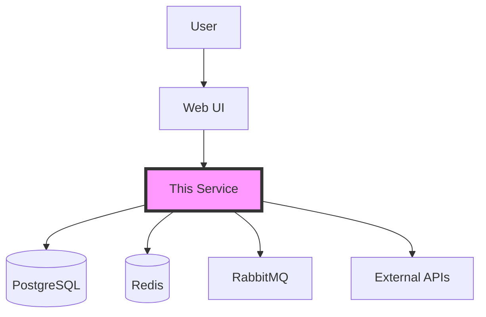

# Complete TDD Documentation Suite v2.0

---

# Table of Contents

1. [TDD Implementation Guide v2.0](#tdd-implementation-guide-v20)
2. [README.md Template](#readmemd-template)
3. [ARCHITECTURE.md Template](#architecturemd-template)
4. [RUNBOOK.md Template](#runbookmd-template)
5. [TDD Quick Reference Card](#tdd-quick-reference-card)
6. [User Story and Workflow Templates](#user-story-and-workflow-templates)
7. [TDD Process Migration Guide](#tdd-process-migration-guide)

---

# TDD Implementation Guide v2.0

## Core Philosophy

**Tests specify behavior. Implementation satisfies tests. Always.**

This guide provides a flexible, pragmatic approach to Test-Driven Development that scales from hotfixes to major features while maintaining quality and velocity.

## Process Selection Decision Tree

```
START
  │
  ├─> Is this a production emergency? ──> YES ──> [Hotfix Process]
  │                                        │
  │                                        NO
  ├─> Is this an experiment/spike? ──> YES ──> [Spike Process]
  │                                     │
  │                                     NO
  ├─> Is this well-understood CRUD? ──> YES ──> [TDD-Light Process]
  │                                      │
  │                                      NO
  ├─> Is this a bug fix? ──> YES ──> [Bugfix Process]
  │                           │
  │                           NO
  └─> [Full TDD Process]
```

## Process Levels

### 🔥 Hotfix Process (Emergency)
**When**: Production is down or severely degraded
**Time**: Fix immediately, tests within 48 hours

1. **FIX** - Implement the fix directly
2. **VERIFY** - Manual testing in staging
3. **DEPLOY** - Push to production
4. **BACKFILL** - Add tests within 48 hours
5. **DOCUMENT** - Update RUNBOOK.md with incident details

### 🧪 Spike Process (Exploration)
**When**: Exploring new technologies or approaches
**Time**: Time-boxed to 2-3 days maximum

1. **EXPLORE** - Build prototype without tests
2. **EVALUATE** - Assess feasibility and value
3. **DECIDE** - Keep or discard
4. If keeping: **REIMPLEMENT** using Full TDD Process

### ⚡ TDD-Light Process (Simple Features)
**When**: Well-understood CRUD operations, simple endpoints
**Time**: 1-4 hours total

1. **SPEC** - Write basic behavior test
2. **CODE** - Implement to pass test
3. **DOCUMENT** - Update README.md only

Example:
```python
def test_get_user_returns_user_data():
    response = client.get('/users/123')
    assert response.status_code == 200
    assert response.json()['id'] == 123
```

### 🐛 Bugfix Process
**When**: Fixing reported bugs
**Time**: 2-8 hours

1. **REPRODUCE** - Write failing test that demonstrates bug
2. **FIX** - Modify code to pass test
3. **VERIFY** - Ensure all other tests still pass
4. **DOCUMENT** - Add to RUNBOOK.md troubleshooting section

### 🚀 Full TDD Process (New Features)
**When**: New features, architectural changes, critical business logic
**Time**: Days to weeks

## Full TDD Cycle Details

### Phase 1: Specification (Max 2 hours)

#### User Story Template
Write from user perspective, no technical details:

```markdown
As a: [user type]
I want to: [action]
So that: [benefit]

Acceptance Criteria:
- [ ] Criterion 1
- [ ] Criterion 2
```

#### Functional Workflow Template
Technical translation of user story:

```markdown
## Workflow: [Name]

### User Interface
- Screens/pages involved
- User interactions

### API Design
- Endpoints
- Request/response formats

### Data Flow
- Sources
- Transformations
- Storage

### Error Scenarios
- Invalid input
- Network failures
- Service errors

### Technical Considerations
- Performance requirements
- Security implications
- Scaling needs
```

### Phase 2: RED - Write Failing Tests (Max 4 hours)

#### Test Structure
```python
def test_should_[behavior]():
    """Test that [component] should [specific behavior]."""
    # GIVEN: Initial state/context
    # WHEN: Action occurs
    # THEN: Expected outcome
```

#### Progressive Test Levels

**Level 1: Basic Behavior**
```python
def test_endpoint_should_return_success():
    response = client.get('/api/resource')
    assert response.status_code == 200
```

**Level 2: Business Logic**
```python
def test_should_calculate_discount_for_premium_users():
    # GIVEN a premium user with a cart
    user = create_premium_user()
    cart = create_cart(user, items=[...], total=100)
    
    # WHEN discount is applied
    final_price = apply_discounts(cart)
    
    # THEN 20% discount is applied
    assert final_price == 80
```

**Level 3: Edge Cases**
```python
def test_should_handle_concurrent_updates_gracefully():
    # Complex scenarios, race conditions, error paths
```

### Phase 3: GREEN - Implementation (Time-boxed per test)

Rules:
- Write MINIMUM code to pass tests
- Don't add features not required by tests
- OK to be ugly at this stage
- Create/update documentation stubs

### Phase 4: REFACTOR - Improve Quality

Checklist:
- [ ] Extract common patterns
- [ ] Improve naming
- [ ] Reduce duplication
- [ ] Update documentation
- [ ] Verify all tests still pass

## Documentation Structure (Simplified)

### Three Essential Documents

```
service/
├── README.md          # Overview & setup
├── ARCHITECTURE.md    # Technical details
├── RUNBOOK.md        # Operations & troubleshooting
├── src/              # Implementation
├── tests/            # Test specifications
└── specs/            # User stories & workflows (optional)
```

### Document Templates
See accompanying template files for each document type.

## Naming Conventions

### Files
- User stories: `story_<feature>.md`
- Workflows: `workflow_<feature>.md`
- Spec tests: `test_<feature>_spec.py`
- Unit tests: `test_<component>.py`

### Test Methods
```python
# Pattern: test_<component>_should_<behavior>
test_auth_service_should_validate_tokens()
test_api_should_return_404_for_unknown_resources()
test_cache_should_expire_after_timeout()
```

## Time-Boxing Guidelines

| Phase | Standard Feature | Complex Feature | CRUD Operation |
|-------|-----------------|-----------------|----------------|
| Spec | 1-2 hours | 2-4 hours | 15 minutes |
| Tests | 2-4 hours | 4-8 hours | 30 minutes |
| Code | 4-8 hours | 1-3 days | 1-2 hours |
| Refactor | 1-2 hours | 4-8 hours | 30 minutes |

**Circuit Breaker**: If any phase exceeds 2x estimated time, stop and reassess scope.

## Anti-Patterns to Avoid

### ❌ Test-After Development
Exception: Hotfixes only, with mandatory backfill

### ❌ Testing Implementation
```python
# BAD: Tests internals
assert obj._private_var == 'expected'

# GOOD: Tests behavior
assert obj.get_status() == 'expected'
```

### ❌ Modifying Tests to Match Bugs
If test fails, fix code not test (unless requirements changed)

### ❌ Giant Test Suites
If test file >300 lines, split by feature

### ❌ Shared Test State
Each test must be completely independent

## External Dependencies & Integrations

### Third-Party APIs
```python
# Use contract testing
def test_external_api_contract():
    mock = create_mock_from_openapi_spec('service.yaml')
    assert mock.validates_contract()
```

### Databases
```python
# Use transaction rollback
def test_database_operation(db_transaction):
    # Test runs in transaction
    # Automatically rolled back after test
```

### Async/Queue Operations
```python
# Use test harness
async def test_async_processing():
    async with TestHarness() as harness:
        await harness.send_message(message)
        result = await harness.wait_for_result()
        assert result.processed
```

## Metrics & Feedback

### Track Weekly
- Time from spec to deployment
- Test coverage percentage
- Bug escape rate
- Documentation accuracy

### Retrospective Questions
1. Which process level was used most?
2. Were time boxes respected?
3. What slowed us down?
4. What should we adjust?

## Process Versioning

This is version 2.0 of our TDD process.

### Change Process
1. Propose changes via pull request
2. Team discussion in weekly retro
3. Trial period (1 sprint)
4. Vote to adopt or revert

### Version History
- v2.0 (Current) - Added process levels and time-boxing
- v1.0 - Original comprehensive TDD approach

## Quick Reference Card

### Daily Checklist
- [ ] Selected appropriate process level?
- [ ] Wrote tests before code?
- [ ] Tests describe behavior, not implementation?
- [ ] Documentation updated?
- [ ] All tests passing?

### Red Flags
- 🚩 Writing code without tests (except hotfixes)
- 🚩 Changing tests to match buggy code
- 🚩 Test suite takes >10 minutes to run
- 🚩 Documentation >1 sprint out of date
- 🚩 Can't run tests locally

## Commands Cheat Sheet

```bash
# Python
pytest tests/test_*_spec.py  # Run specs only
pytest --cov=src             # With coverage
pytest -x                    # Stop on first failure

# Node.js
npm test -- --watch          # Watch mode
npm test -- --coverage       # Coverage report
npm test -- test.spec.js     # Single file

# Go
go test ./... -v            # Verbose
go test -cover              # Coverage
go test -race               # Race detection

# Docker environments
docker-compose run test     # Run test suite
docker-compose up -d        # Start services
docker-compose logs -f app  # Follow logs
```

## Support

- **Questions**: #tdd-help channel in Slack
- **Process Improvements**: Submit PR to this document
- **Training**: Weekly TDD workshop (Fridays 2pm)
- **Code Reviews**: Tag #tdd-reviewers for TDD-focused review

---

Remember: **The goal is sustainable quality, not perfect process.** Use the right tool for the job, and always keep the team's velocity and morale in balance with code quality.

---

# README.md Template

# Service Name


## What This Service Does

**One-liner**: [Single sentence describing the service's purpose]

**Key Features**:
- Feature 1: Brief description
- Feature 2: Brief description
- Feature 3: Brief description

## Quick Start

### Prerequisites
- Docker 20.10+
- Node.js 18+ (for local development)
- PostgreSQL 14+ (or use Docker)

### Run with Docker (Recommended)
```bash
# Clone and enter directory
git clone [repository-url]
cd [service-name]

# Start all services
docker-compose up

# Service available at http://localhost:3000
```

### Local Development
```bash
# Install dependencies
npm install

# Copy environment variables
cp .env.example .env

# Run database migrations
npm run db:migrate

# Start development server
npm run dev
```

## Configuration

### Required Environment Variables
| Variable | Description | Example | Where Set |
|----------|-------------|---------|-----------|
| DATABASE_URL | PostgreSQL connection | postgresql://... | .env |
| JWT_SECRET | Token signing key | random-string | .env |
| API_KEY | External service key | abc123 | .env |

### Obtaining Credentials
- **Database**: Auto-created in Docker, or see DevOps team for cloud instances
- **JWT_SECRET**: Generate with `openssl rand -hex 32`
- **API_KEY**: Request from #api-keys Slack channel

## API Overview

### Key Endpoints
| Method | Endpoint | Description | Auth Required |
|--------|----------|-------------|---------------|
| GET | /health | Health check | No |
| POST | /api/v1/resource | Create resource | Yes |
| GET | /api/v1/resource/:id | Get resource | Yes |
| PUT | /api/v1/resource/:id | Update resource | Yes |
| DELETE | /api/v1/resource/:id | Delete resource | Yes |

### Authentication
```bash
# Get token
curl -X POST http://localhost:3000/auth/login \
  -H "Content-Type: application/json" \
  -d '{"username":"user","password":"pass"}'

# Use token
curl http://localhost:3000/api/v1/resource \
  -H "Authorization: Bearer YOUR_TOKEN"
```

Full API docs: http://localhost:3000/api-docs (when running)

## Testing

```bash
# Run all tests
npm test

# Watch mode (development)
npm run test:watch

# With coverage
npm run test:coverage

# Run specific test file
npm test -- test_auth_spec.py
```

## Project Structure

```
service/
├── src/
│   ├── api/          # API routes
│   ├── services/     # Business logic
│   ├── models/       # Data models
│   └── utils/        # Utilities
├── tests/
│   ├── specs/        # Behavior specifications
│   └── unit/         # Unit tests
├── docker-compose.yml
└── package.json
```

## Troubleshooting

### Common Issues

**Service won't start**
```bash
# Check logs
docker-compose logs app

# Reset everything
docker-compose down -v
docker-compose up --build
```

**Database connection failed**
```bash
# Verify PostgreSQL is running
docker-compose ps

# Check connection string
echo $DATABASE_URL
```

**Tests failing locally but not in CI**
```bash
# Run tests in Docker (same as CI)
docker-compose run test
```

For more issues, see [RUNBOOK.md](./RUNBOOK.md)

## Related Services

- **auth-service**: Handles authentication
- **user-service**: User management
- **notification-service**: Email/SMS notifications

## Contributing

1. Create feature branch from `main`
2. Write tests first (TDD)
3. Implement feature
4. Update documentation
5. Submit pull request

See [TDD Guide](../docs/tdd-guide.md) for our development process.

## Support

- **Team**: Platform Team
- **Slack**: #platform-support
- **On-call**: See PagerDuty schedule
- **Documentation**: [Internal Wiki](wiki-link)

## License

[Your License] - See LICENSE file for details

---

# ARCHITECTURE.md Template

# Architecture Documentation

## System Context



## Design Decisions

### Decision: Use Event-Driven Architecture
**Context**: Need to handle async operations without blocking API responses  
**Decision**: Implement event queue with RabbitMQ  
**Consequences**: 
- ✅ Better scalability and resilience
- ✅ Decoupled components
- ⚠️ Increased complexity
- ⚠️ Eventual consistency

### Decision: PostgreSQL for Primary Storage
**Context**: Need ACID compliance for financial data  
**Decision**: PostgreSQL with read replicas  
**Consequences**:
- ✅ Strong consistency guarantees
- ✅ Complex query support
- ⚠️ Vertical scaling limitations
- ⚠️ Replication lag for read replicas

## Data Model

### Core Entities

```sql
-- Users table (simplified)
CREATE TABLE users (
    id UUID PRIMARY KEY DEFAULT gen_random_uuid(),
    email VARCHAR(255) UNIQUE NOT NULL,
    created_at TIMESTAMP DEFAULT NOW(),
    updated_at TIMESTAMP DEFAULT NOW()
);

-- Resources table
CREATE TABLE resources (
    id UUID PRIMARY KEY DEFAULT gen_random_uuid(),
    user_id UUID REFERENCES users(id),
    data JSONB NOT NULL,
    status VARCHAR(50) DEFAULT 'pending',
    created_at TIMESTAMP DEFAULT NOW()
);

-- Audit log
CREATE TABLE audit_log (
    id BIGSERIAL PRIMARY KEY,
    user_id UUID,
    action VARCHAR(100),
    resource_type VARCHAR(50),
    resource_id UUID,
    metadata JSONB,
    created_at TIMESTAMP DEFAULT NOW()
);
```

### Data Flow Patterns

1. **Synchronous Operations**
   - User authentication
   - Simple CRUD operations
   - Health checks

2. **Asynchronous Operations**
   - File processing
   - External API calls
   - Email notifications
   - Report generation

## Service Components

### API Layer
- **Framework**: Express.js / FastAPI / Go Fiber
- **Pattern**: RESTful with optional GraphQL
- **Versioning**: URL-based (/api/v1, /api/v2)
- **Rate Limiting**: 100 req/min per user

### Business Logic Layer
```
services/
├── authService.js       # Authentication logic
├── resourceService.js    # Core business logic
├── validationService.js  # Input validation
└── notificationService.js # Async notifications
```

### Data Access Layer
- **ORM**: Prisma / SQLAlchemy / GORM
- **Migrations**: Tracked in migrations/ folder
- **Connection Pool**: 20 connections (configurable)

## Integration Patterns

### External Service Integration

```javascript
// Circuit breaker pattern for external APIs
class ExternalAPIClient {
    constructor() {
        this.circuitBreaker = new CircuitBreaker({
            threshold: 5,        // failures before opening
            timeout: 30000,      // ms before retry
            fallback: this.fallbackResponse
        });
    }
    
    async call(endpoint, data) {
        return this.circuitBreaker.execute(
            () => this.makeRequest(endpoint, data)
        );
    }
}
```

### Message Queue Pattern

```javascript
// Publisher
async function publishEvent(eventType, payload) {
    const message = {
        id: uuid(),
        type: eventType,
        timestamp: Date.now(),
        payload,
        version: '1.0'
    };
    await queue.publish('events', message);
}

// Consumer
async function consumeEvents() {
    await queue.subscribe('events', async (message) => {
        try {
            await processEvent(message);
            await message.ack();
        } catch (error) {
            await message.nack();
            await deadLetterQueue.publish(message);
        }
    });
}
```

## Security Architecture

### Authentication & Authorization
- **Method**: JWT with refresh tokens
- **Token Lifetime**: 15 minutes (access), 7 days (refresh)
- **Storage**: Access token in memory, refresh in httpOnly cookie

### Data Protection
- **Encryption at Rest**: AES-256 for sensitive fields
- **Encryption in Transit**: TLS 1.3 minimum
- **Key Management**: AWS KMS / HashiCorp Vault

### API Security
```javascript
// Rate limiting by user tier
const rateLimits = {
    free: { window: '1m', max: 10 },
    premium: { window: '1m', max: 100 },
    enterprise: { window: '1m', max: 1000 }
};
```

## Performance Considerations

### Caching Strategy

**Three-Layer Cache**:
1. **Browser Cache**: Static assets (1 year)
2. **CDN Cache**: API responses (5 minutes)
3. **Redis Cache**: Database queries (1 hour)

```javascript
// Cache-aside pattern
async function getResource(id) {
    // Check cache
    let data = await cache.get(`resource:${id}`);
    if (data) return data;
    
    // Load from database
    data = await db.resources.findOne({ id });
    
    // Store in cache
    await cache.set(`resource:${id}`, data, 'EX', 3600);
    
    return data;
}
```

### Database Optimization
- **Indexes**: On foreign keys and commonly queried fields
- **Partitioning**: By date for time-series data
- **Connection Pooling**: Min 5, Max 20 connections
- **Query Optimization**: EXPLAIN ANALYZE on slow queries

## Scalability Design

### Horizontal Scaling
```yaml
# Kubernetes deployment example
replicas: 3
resources:
  requests:
    memory: "256Mi"
    cpu: "250m"
  limits:
    memory: "512Mi"
    cpu: "500m"
```

### Load Balancing
- **Algorithm**: Round-robin with health checks
- **Session Affinity**: Not required (stateless design)
- **Health Check**: GET /health every 10s

## Monitoring & Observability

### Key Metrics
```javascript
// Custom metrics
metrics.histogram('api_request_duration', {
    endpoint: req.path,
    method: req.method,
    status: res.statusCode
});

metrics.gauge('database_connections', {
    state: 'active',
    count: pool.activeCount
});

metrics.counter('business_events', {
    type: 'resource_created',
    user_tier: user.tier
});
```

### Distributed Tracing
- **Tool**: OpenTelemetry / Jaeger
- **Sampling Rate**: 10% for normal, 100% for errors
- **Retention**: 7 days

### Logging
```javascript
// Structured logging
logger.info('Resource created', {
    userId: user.id,
    resourceId: resource.id,
    duration: Date.now() - start,
    metadata: { ...additionalInfo }
});
```

## Deployment Architecture

### Container Structure
```dockerfile
# Multi-stage build
FROM node:18-alpine AS builder
# Build stage...

FROM node:18-alpine AS runtime
# Runtime stage...
```

### Environment Configuration
- **Development**: Docker Compose with hot-reload
- **Staging**: Kubernetes with 2 replicas
- **Production**: Kubernetes with auto-scaling (3-10 replicas)

## Disaster Recovery

### Backup Strategy
- **Database**: Daily snapshots, 30-day retention
- **File Storage**: Cross-region replication
- **Configuration**: GitOps with version control

### Recovery Procedures
1. **RTO**: 1 hour
2. **RPO**: 1 hour
3. **Failover**: Automated with health checks
4. **Rollback**: Blue-green deployment

## Technical Debt & Future Improvements

### Current Technical Debt
1. **Legacy API endpoints** - Deprecate v1 by Q2
2. **Synchronous external calls** - Move to async queue
3. **Monolithic service** - Consider splitting auth service

### Planned Improvements
1. **GraphQL federation** - Q1 2025
2. **Event sourcing** - Q2 2025
3. **Multi-region deployment** - Q3 2025

## Appendix

### Technology Stack
- **Runtime**: Node.js 18 / Python 3.11 / Go 1.21
- **Framework**: Express / FastAPI / Fiber
- **Database**: PostgreSQL 14
- **Cache**: Redis 7
- **Queue**: RabbitMQ 3.12
- **Container**: Docker 24
- **Orchestration**: Kubernetes 1.28

### References
- [Design Patterns](https://refactoring.guru/design-patterns)
- [12 Factor App](https://12factor.net/)
- [Domain-Driven Design](https://martinfowler.com/bliki/DomainDrivenDesign.html)
- [Internal Architecture Guidelines](wiki-link)

---

Last Updated: [Date]  
Maintained By: [Team Name]  
Review Cycle: Quarterly

---

# RUNBOOK.md Template

# Service Runbook

**Service**: [Service Name]  
**Criticality**: P1 / P2 / P3  
**On-call Team**: [Team Name]  
**Last Incident**: [Date]  

## Emergency Contacts

| Role | Name | Contact | When to Contact |
|------|------|---------|-----------------|
| Service Owner | John Doe | @johnd / 555-0100 | Major incidents |
| Tech Lead | Jane Smith | @janes / 555-0101 | Architecture questions |
| DevOps Lead | Bob Wilson | @bobw / 555-0102 | Infrastructure issues |
| Product Owner | Alice Chen | @alicec / 555-0103 | Business impact |

## Service Health Indicators

### 🟢 Healthy State
- Response time: <200ms p99
- Error rate: <0.1%
- CPU usage: <60%
- Memory usage: <70%
- Queue depth: <1000 messages

### 🟡 Degraded State
- Response time: 200-500ms p99
- Error rate: 0.1-1%
- CPU usage: 60-80%
- Memory usage: 70-85%
- Queue depth: 1000-5000 messages

### 🔴 Critical State
- Response time: >500ms p99
- Error rate: >1%
- CPU usage: >80%
- Memory usage: >85%
- Queue depth: >5000 messages

## Common Issues & Solutions

### Issue: Service Won't Start

**Symptoms**:
- Health check failing
- Container restarting repeatedly
- No logs being generated

**Diagnosis**:
```bash
# Check container status
kubectl get pods -n production
kubectl describe pod [pod-name]

# Check logs
kubectl logs [pod-name] --tail=100

# Check environment variables
kubectl exec [pod-name] -- env | grep -E "DATABASE|API"
```

**Solutions**:
1. **Missing environment variables**
   ```bash
   # Verify secrets are mounted
   kubectl get secrets -n production
   # Recreate secret if missing
   kubectl create secret generic app-secrets --from-env-file=.env
   ```

2. **Database connection failed**
   ```bash
   # Test database connectivity
   kubectl exec [pod-name] -- nc -zv [db-host] 5432
   # Check database credentials
   kubectl get secret db-secret -o yaml
   ```

3. **Port already in use**
   ```bash
   # Find process using port
   lsof -i :3000
   # Kill process or change port
   ```

---

### Issue: High Memory Usage

**Symptoms**:
- Memory usage >85%
- OOM kills in logs
- Slow response times

**Diagnosis**:
```bash
# Check memory usage
kubectl top pods -n production

# Analyze heap dump
kubectl exec [pod-name] -- kill -USR2 1
kubectl cp [pod-name]:/tmp/heapdump.hprof ./heapdump.hprof

# Check for memory leaks
kubectl logs [pod-name] | grep -i "memory\|heap\|gc"
```

**Solutions**:
1. **Immediate mitigation**
   ```bash
   # Scale horizontally
   kubectl scale deployment [service] --replicas=5
   
   # Restart pods with memory leak
   kubectl rollout restart deployment [service]
   ```

2. **Long-term fix**
   - Review recent code changes
   - Check for unclosed connections
   - Profile memory usage locally
   - Increase memory limits if justified

---

### Issue: Database Connection Pool Exhausted

**Symptoms**:
- "Too many connections" errors
- Timeouts on database queries
- Degraded API performance

**Diagnosis**:
```sql
-- Check active connections
SELECT count(*) FROM pg_stat_activity;

-- See connections by state
SELECT state, count(*) 
FROM pg_stat_activity 
GROUP BY state;

-- Find long-running queries
SELECT pid, age(clock_timestamp(), query_start), query 
FROM pg_stat_activity 
WHERE state != 'idle' 
ORDER BY query_start;
```

**Solutions**:
1. **Kill idle connections**
   ```sql
   SELECT pg_terminate_backend(pid) 
   FROM pg_stat_activity 
   WHERE state = 'idle' 
   AND query_start < NOW() - INTERVAL '10 minutes';
   ```

2. **Adjust pool settings**
   ```javascript
   // Increase pool size temporarily
   DATABASE_POOL_MAX=50  # Was 20
   DATABASE_POOL_MIN=10  # Was 5
   ```

3. **Find connection leak**
   - Check for missing `connection.close()`
   - Review transaction handling
   - Enable pool logging

---

### Issue: External API Rate Limiting

**Symptoms**:
- 429 responses from external services
- Delayed processing
- Queue backup

**Diagnosis**:
```bash
# Check rate limit headers
curl -I https://api.external.com/endpoint

# Monitor rate limit metrics
kubectl exec [pod-name] -- curl localhost:9090/metrics | grep rate_limit
```

**Solutions**:
1. **Implement backoff**
   ```javascript
   // Exponential backoff
   let delay = 1000;
   for (let i = 0; i < maxRetries; i++) {
       try {
           return await makeRequest();
       } catch (error) {
           if (error.status === 429) {
               await sleep(delay);
               delay *= 2;
           }
       }
   }
   ```

2. **Use caching**
   - Cache successful responses
   - Implement request deduplication
   - Batch requests when possible

## Deployment Procedures

### Standard Deployment

```bash
# 1. Run tests
npm test

# 2. Build and tag image
docker build -t service:v1.2.3 .
docker push registry/service:v1.2.3

# 3. Update Kubernetes
kubectl set image deployment/service service=registry/service:v1.2.3

# 4. Monitor rollout
kubectl rollout status deployment/service

# 5. Verify health
curl https://service.prod.com/health
```

### Emergency Rollback

```bash
# Immediate rollback to previous version
kubectl rollout undo deployment/service

# Rollback to specific version
kubectl rollout undo deployment/service --to-revision=42

# Verify rollback
kubectl rollout status deployment/service
kubectl get pods -l app=service
```

### Blue-Green Deployment

```bash
# Deploy to green environment
kubectl apply -f k8s/green-deployment.yaml

# Test green environment
curl https://service-green.prod.com/health

# Switch traffic to green
kubectl patch service/service -p '{"spec":{"selector":{"version":"green"}}}'

# Keep blue for quick rollback
# After verification, remove blue
kubectl delete deployment/service-blue
```

## Monitoring & Alerts

### Key Dashboards
- **Service Overview**: https://grafana.company.com/d/service-overview
- **Database Metrics**: https://grafana.company.com/d/database
- **Business Metrics**: https://grafana.company.com/d/business
- **Error Tracking**: https://sentry.company.com/service

### Alert Responses

**High Error Rate Alert**
1. Check error details in Sentry
2. Identify pattern (specific endpoint? user?)
3. Check recent deployments
4. Rollback if deployment-related
5. Scale up if load-related

**Database Slow Query Alert**
1. Identify slow queries in logs
2. Check query execution plan
3. Add missing indexes if needed
4. Kill long-running queries if blocking

**Queue Depth Alert**
1. Check consumer health
2. Scale consumers if needed
3. Check for poison messages
4. Drain to dead letter queue if necessary

## Maintenance Procedures

### Database Maintenance

```bash
# Backup before maintenance
pg_dump -h localhost -U postgres dbname > backup_$(date +%Y%m%d).sql

# Vacuum and analyze
psql -c "VACUUM ANALYZE;"

# Reindex if needed
psql -c "REINDEX DATABASE dbname;"
```

### Certificate Renewal

```bash
# Check certificate expiration
echo | openssl s_client -connect service.com:443 2>/dev/null | openssl x509 -noout -dates

# Renew with certbot
certbot renew --force-renewal

# Update Kubernetes secret
kubectl create secret tls service-tls --cert=cert.pem --key=key.pem --dry-run -o yaml | kubectl apply -f -
```

### Dependency Updates

```bash
# Check for outdated packages
npm outdated

# Update dependencies safely
npm update --save

# Test after updates
npm test

# Update base image
docker pull node:18-alpine
docker build --no-cache -t service:latest .
```

## Disaster Recovery

### Data Recovery

1. **Identify last good backup**
   ```bash
   aws s3 ls s3://backups/database/ --recursive
   ```

2. **Restore database**
   ```bash
   # Stop application
   kubectl scale deployment/service --replicas=0
   
   # Restore backup
   psql -h localhost -U postgres dbname < backup_20240115.sql
   
   # Verify data
   psql -c "SELECT COUNT(*) FROM users;"
   
   # Restart application
   kubectl scale deployment/service --replicas=3
   ```

### Service Recovery

1. **Complete service failure**
   ```bash
   # Deploy to alternate region
   kubectl config use-context us-west-2
   kubectl apply -f k8s/
   
   # Update DNS
   aws route53 change-resource-record-sets --hosted-zone-id Z123 --change-batch file://failover.json
   ```

2. **Corrupted deployment**
   ```bash
   # Redeploy from known good commit
   git checkout [last-known-good-commit]
   ./deploy.sh production
   ```

## Performance Tuning

### Database Queries

```sql
-- Find missing indexes
SELECT schemaname, tablename, attname, n_distinct, correlation
FROM pg_stats
WHERE schemaname NOT IN ('pg_catalog', 'information_schema')
AND n_distinct > 100
AND correlation < 0.1
ORDER BY n_distinct DESC;

-- Find unused indexes
SELECT schemaname, tablename, indexname, idx_scan
FROM pg_stat_user_indexes
WHERE idx_scan = 0
ORDER BY schemaname, tablename;
```

### Application Profiling

```bash
# CPU profiling
node --prof app.js
node --prof-process isolate-*.log > profile.txt

# Memory profiling
node --expose-gc --trace-gc app.js

# APM profiling
# Enable DataDog/NewRelic profiling in production for 1 hour
```

## Security Procedures

### Incident Response

1. **Isolate affected systems**
   ```bash
   # Remove from load balancer
   kubectl label pod [pod-name] isolated=true
   ```

2. **Preserve evidence**
   ```bash
   # Capture logs
   kubectl logs [pod-name] > incident_$(date +%Y%m%d_%H%M%S).log
   
   # Capture network connections
   kubectl exec [pod-name] -- netstat -an > connections.txt
   ```

3. **Rotate credentials**
   ```bash
   # Generate new secrets
   openssl rand -hex 32 > new_jwt_secret
   
   # Update Kubernetes secrets
   kubectl delete secret app-secrets
   kubectl create secret generic app-secrets --from-file=jwt_secret=new_jwt_secret
   
   # Restart pods
   kubectl rollout restart deployment/service
   ```

### Secret Rotation

```bash
# Quarterly secret rotation procedure
# 1. Generate new secrets
./scripts/generate-secrets.sh

# 2. Update in vault
vault kv put secret/service/prod @new-secrets.json

# 3. Sync to Kubernetes
kubectl create secret generic service-secrets --from-literal=api-key=$NEW_API_KEY

# 4. Rolling restart
kubectl rollout restart deployment/service -n production

# 5. Verify old secrets are revoked
./scripts/verify-secret-rotation.sh
```

## Appendix

### Useful Commands

```bash
# Get pod logs with timestamps
kubectl logs [pod] --timestamps=true

# Execute commands in container
kubectl exec -it [pod] -- /bin/sh

# Port forward for debugging
kubectl port-forward [pod] 3000:3000

# Copy files from pod
kubectl cp [pod]:/path/to/file ./local-file

# Describe all resources
kubectl describe all -n production

# Get events
kubectl get events --sort-by='.lastTimestamp'
```

### Environment URLs

| Environment | URL | Purpose |
|-------------|-----|---------|
| Production | https://api.company.com | Live traffic |
| Staging | https://api-staging.company.com | Pre-production |
| Development | https://api-dev.company.com | Development |
| Local | http://localhost:3000 | Local testing |

### Related Documentation

- [Architecture Document](./ARCHITECTURE.md)
- [API Documentation](./API.md)
- [Security Policies](https://wiki.company.com/security)
- [Incident Process](https://wiki.company.com/incidents)
- [Company Runbook Template](https://wiki.company.com/runbook-template)

---

**Last Updated**: [Date]  
**Next Review**: [Date + 3 months]  
**Feedback**: Create issue or PR in repository

---

# TDD Quick Reference Card

## Process Selection (30 seconds)

```
🔥 Production down?           → HOTFIX (fix now, test later)
🧪 Exploring/Learning?        → SPIKE (prototype first)
⚡ Simple CRUD?               → TDD-LIGHT (basic tests)
🐛 Bug fix?                   → BUGFIX (reproduce → fix)
🚀 Everything else            → FULL TDD
```

## The TDD Rhythm

### RED (Write Failing Tests)
```python
def test_should_do_something():
    # GIVEN: Setup
    # WHEN: Action
    # THEN: Assert
    assert False  # Start here!
```
⏱️ Time-box: 4 hours max

### GREEN (Make Tests Pass)
```python
# Write MINIMUM code
# Don't be clever yet
# Just make it work
```
⏱️ Time-box: 1 day max

### REFACTOR (Clean Up)
```python
# Now make it pretty
# Extract patterns
# Update docs
```
⏱️ Time-box: 2 hours max

## Test Naming

✅ **GOOD**: `test_service_should_validate_email_format()`  
❌ **BAD**: `test_email()` or `test_validation_works()`

Pattern: `test_[component]_should_[behavior]()`

## Code Smells in Tests

🚩 **Test depends on another test** → Add setup/teardown  
🚩 **Testing private methods** → Test public interface  
🚩 **Lots of mocking** → Reconsider design  
🚩 **Tests break on refactor** → Testing implementation, not behavior  
🚩 **Can't write test first** → Design problem  

## Emergency Procedures

### When Tests Are Hard to Write
1. **Simplify the requirement** - Break into smaller pieces
2. **Question the design** - Hard to test = hard to use
3. **Pair program** - Two heads better than one
4. **Time-box effort** - 2 hours max, then ask for help

### When You're Stuck
```bash
# Take a break
git stash
go for walk

# Start fresh
git checkout -b spike-solution
# Experiment freely

# Apply learning
git checkout main
git branch -D spike-solution
# Now write tests with new knowledge
```

## Common Patterns

### Testing Async Code
```python
async def test_should_handle_async():
    # GIVEN
    mock_api = AsyncMock(return_value={"data": "test"})
    
    # WHEN
    result = await process_async(mock_api)
    
    # THEN
    assert result["status"] == "success"
```

### Testing External APIs
```python
@patch('requests.get')
def test_should_handle_api_failure(mock_get):
    # GIVEN
    mock_get.side_effect = RequestException()
    
    # WHEN
    result = call_external_api()
    
    # THEN
    assert result == FALLBACK_VALUE
```

### Testing Database Operations
```python
def test_should_save_user(db_transaction):
    # GIVEN - runs in transaction
    user = User(name="Test")
    
    # WHEN
    user.save()
    
    # THEN
    assert User.count() == 1
    # Transaction auto-rollback after test
```

## Time Budgets

| Activity | Simple Feature | Complex Feature |
|----------|---------------|-----------------|
| Write Specs | 30 min | 2 hours |
| Write Tests | 1 hour | 4 hours |
| Implement | 2 hours | 1-2 days |
| Refactor | 30 min | 2 hours |
| **Total** | **4 hours** | **2-3 days** |

**Circuit Breaker**: If taking 2x longer → STOP & reassess

## Daily Checklist

### Morning
- [ ] Pick work from backlog
- [ ] Choose process level (Hotfix/Spike/Light/Full)
- [ ] Write user story (if Full TDD)

### Before Coding
- [ ] Write at least one failing test
- [ ] Run tests to see RED
- [ ] Commit the failing test

### After Coding
- [ ] All tests GREEN?
- [ ] Code reviewed by tests?
- [ ] Documentation updated?

### Before Push
- [ ] Run full test suite
- [ ] Check test coverage
- [ ] Update RUNBOOK if needed

## Test Commands

```bash
# Python
pytest tests/ -v              # Verbose
pytest tests/ -x              # Stop on first failure
pytest tests/ --lf            # Run last failed
pytest --cov=src --cov-report=term-missing

# JavaScript/Node
npm test                      # Run all
npm test -- --watch          # Watch mode
npm test -- --coverage       # Coverage
npm test -- test.spec.js     # Single file

# Go
go test ./...                # All packages
go test -v ./...            # Verbose
go test -race ./...         # Race detection
go test -cover ./...        # Coverage

# In Docker
docker-compose run test      # Run suite
docker-compose run test bash # Debug
```

## Help & Resources

🆘 **Stuck?** → #tdd-help in Slack  
📚 **Learn** → Weekly TDD Workshop, Fridays 2pm  
👀 **Review** → Tag @tdd-reviewers in PR  
📖 **Docs** → See full [TDD Implementation Guide](./tdd-implementation-guide.md)

## The Golden Rules

1. **Tests first, always** (except hotfixes)
2. **Test behavior, not implementation**
3. **If test is hard to write, redesign the code**
4. **Each test must be independent**
5. **Red → Green → Refactor** (in that order)

## Anti-Pattern Bingo

Don't do these:
- ❌ Change test to match buggy code
- ❌ Skip tests because "it's simple"
- ❌ Test after implementation
- ❌ Share state between tests
- ❌ Test private methods/variables
- ❌ Write tests that never fail
- ❌ Ignore failing tests
- ❌ Delete inconvenient tests

---

**Remember**: The goal is sustainable quality, not perfect process.  
**When in doubt**: Write the test first.  
**Version**: 2.0 | **Updated**: [Date]

---

# User Story and Workflow Templates

## User Story Template

```markdown
# User Story: [Feature Name]

## Story
**As a**: [type of user]  
**I want to**: [action/goal]  
**So that**: [benefit/value]

## Acceptance Criteria
From the user's perspective, with no technical details:

- [ ] I can [do something]
- [ ] I see [some feedback]
- [ ] I receive [some result]
- [ ] When [condition], then [outcome]
- [ ] The system prevents me from [invalid action]

## User Journey
1. I start at [starting point]
2. I [take action]
3. The system [responds]
4. I [take another action]
5. I see [final result]

## Success Metrics
- User can complete task in < X minutes
- No more than Y clicks/steps required
- Error rate < Z%

## Out of Scope
- [Thing we're NOT doing]
- [Another thing we're NOT doing]

## Notes
- Related to [other feature]
- Depends on [prerequisite]
- Impacts [downstream system]
```

### Example User Story

```markdown
# User Story: Email Synchronization

## Story
**As a**: user of My Footprints  
**I want to**: connect my Gmail account  
**So that**: I can discover and analyze my email-based digital footprint

## Acceptance Criteria
- [ ] I can connect my Gmail account using my Google credentials
- [ ] I see progress updates while my emails are being synchronized
- [ ] I receive a notification when synchronization completes
- [ ] I can pause and resume synchronization if needed
- [ ] I'm prevented from starting duplicate sync jobs
- [ ] I can view discovered artifacts from my emails

## User Journey
1. I start at my dashboard after logging in
2. I navigate to Account Settings
3. I choose to add a Gmail connection
4. I authenticate with Google (redirected and back)
5. I see synchronization begin automatically
6. I can monitor progress or navigate away
7. I receive notification when complete
8. I can view my email artifacts

## Success Metrics
- Connection process completes in < 2 minutes
- 95% of sync jobs complete successfully
- Users can find their artifacts within 1 click of notification

## Out of Scope
- Other email providers (Outlook, Yahoo, etc.)
- Email composition or sending
- Modifying synchronized data
- Real-time synchronization

## Notes
- Related to general artifact discovery feature
- Depends on OAuth implementation
- Impacts storage and processing capacity
```

---

## Functional Workflow Template

```markdown
# Workflow: [Feature Name - Technical]

## Overview
Technical implementation of user story: [link to user story]

## Frontend Flow

### Screens/Pages
1. **[Screen Name]**
   - URL: `/path`
   - Components: [list key components]
   - State management: [approach]

### User Interactions
1. User clicks [button] → [what happens]
2. User enters [data] → [validation]
3. System shows [feedback] → [how/where]

### Navigation Flow
```
Start → Page A → Page B → Success
              ↓
          Error Page
```

## Backend Flow

### API Endpoints
| Method | Path | Purpose | Auth |
|--------|------|---------|------|
| POST | /api/v1/[resource] | Create | JWT |
| GET | /api/v1/[resource]/:id | Read | JWT |

### Service Communication
```
API Gateway → Auth Service → Main Service → Database
                          ↓
                   Queue Service → Worker
```

### External Services
- Service A: [purpose, rate limits]
- Service B: [purpose, authentication]

## Data Flow

### Input Data
```json
{
  "field1": "string",
  "field2": 123,
  "field3": {
    "nested": "object"
  }
}
```

### Processing Steps
1. Validate input against schema
2. Check permissions
3. Transform data
4. Store in database
5. Publish event
6. Return response

### Output Data
```json
{
  "id": "uuid",
  "status": "success",
  "data": {
    "processed": true
  }
}
```

### Storage
- **Primary DB**: PostgreSQL table `resources`
- **Cache**: Redis key pattern `resource:{id}`
- **Files**: S3 bucket `uploads/[year]/[month]/`

## Error Handling

### Input Validation Errors
- **Trigger**: Invalid data format
- **Response**: 400 Bad Request
- **User sees**: "Please check your input"
- **Logged**: Warning level

### Authentication Errors
- **Trigger**: Invalid/expired token
- **Response**: 401 Unauthorized
- **User sees**: Redirect to login
- **Logged**: Info level

### External Service Errors
- **Trigger**: Third-party API timeout/error
- **Response**: 503 Service Unavailable
- **User sees**: "Service temporarily unavailable"
- **Retry**: Exponential backoff
- **Fallback**: Cache or queue for later

### Database Errors
- **Trigger**: Connection failure, constraint violation
- **Response**: 500 Internal Server Error
- **User sees**: "Something went wrong"
- **Action**: Alert on-call
- **Logged**: Error level

## Technical Considerations

### Performance Requirements
- Response time: < 200ms p95
- Throughput: 1000 req/sec
- Concurrent users: 10,000

### Security Requirements
- Authentication: JWT with refresh tokens
- Authorization: Role-based (user, admin)
- Encryption: TLS 1.3, AES-256 at rest
- Rate limiting: 100 req/min per user

### Scalability Approach
- Horizontal scaling via Kubernetes
- Database read replicas
- Redis cache layer
- Queue for async processing

### Dependencies
- Internal: Auth Service v2.0+
- External: Google OAuth API
- Libraries: Express, Prisma, Bull

### Technical Debt Notes
- Consider replacing [old thing] with [new thing]
- Temporary workaround for [issue]
- Need to refactor [component] later
```

### Example Functional Workflow

```markdown
# Workflow: Gmail Synchronization

## Overview
Technical implementation of Gmail sync user story

## Frontend Flow

### Screens/Pages
1. **Account Settings**
   - URL: `/settings/accounts`
   - Components: ConnectorList, AddConnectorButton
   - State: Redux store for connectors

2. **OAuth Flow**
   - URL: `/auth/google/callback`
   - Components: OAuthHandler
   - State: Session storage for OAuth state

3. **Sync Progress**
   - URL: `/sync/gmail/:id`
   - Components: ProgressBar, SyncStats
   - State: WebSocket for real-time updates

### User Interactions
1. Click "Add Gmail" → OAuth redirect
2. Authorize in Google → Callback to app
3. View progress → WebSocket connection
4. Click "Pause" → API call to pause job

## Backend Flow

### API Endpoints
| Method | Path | Purpose | Auth |
|--------|------|---------|------|
| POST | /api/v1/connectors/gmail | Create | JWT |
| GET | /api/v1/sync/:id/status | Status | JWT |
| POST | /api/v1/sync/:id/pause | Pause | JWT |
| DELETE | /api/v1/sync/:id | Cancel | JWT |

### Service Communication
```
API Gateway → Auth Service → Connector Service → Database
                          ↓
                   Queue Service → Sync Worker → Gmail API
                                              ↓
                                      Artifact Service
```

## Data Flow

### Input Data
```json
{
  "provider": "gmail",
  "auth_code": "oauth_code_from_google",
  "options": {
    "sync_attachments": true,
    "date_range": "all"
  }
}
```

### Processing Steps
1. Exchange auth code for tokens
2. Store encrypted tokens
3. Create sync job record
4. Queue sync task
5. Worker fetches emails in batches
6. Extract artifacts from emails
7. Store artifacts in database
8. Update progress in cache
9. Send completion notification

### Storage
- **OAuth Tokens**: Encrypted in `user_credentials` table
- **Sync Status**: Redis key `sync:gmail:{job_id}`
- **Email Metadata**: PostgreSQL `email_artifacts` table
- **Attachments**: S3 `email-attachments/[user_id]/`

## Error Handling

### OAuth Errors
- **Trigger**: Invalid/revoked credentials
- **Response**: 401, clear stored tokens
- **User sees**: "Please reconnect your account"

### Rate Limit Errors
- **Trigger**: Gmail API rate limit
- **Response**: Queue with backoff
- **User sees**: "Sync slowed due to rate limits"

### Storage Errors
- **Trigger**: S3 unavailable
- **Response**: Retry with local buffer
- **User sees**: Progress continues

## Technical Considerations

### Performance Requirements
- Process 10,000 emails/minute
- Support 100 concurrent sync jobs
- Complete average inbox in < 10 minutes

### Security Requirements
- OAuth tokens encrypted with AES-256
- Tokens never exposed to frontend
- Automatic token refresh
- Audit log all access

### Scalability Approach
- Multiple sync workers
- Batch processing (100 emails/batch)
- Checkpoint/resume capability
- Priority queue for active users
```

---

## Usage Guidelines

### When to Create User Stories
- New features requested by users/product
- Significant changes to existing features  
- Before any work that affects user experience

### When to Create Workflows
- After user story is approved
- Before writing any tests
- When technical approach needs agreement

### Keep Stories and Workflows Separate
- **User Story**: Zero technical details, pure user perspective
- **Workflow**: All technical details, implementation focused

### Time Limits
- User Story: 30 minutes maximum to write
- Workflow: 2 hours maximum to write
- If taking longer, scope is too large

### Review Process
1. Product reviews user story
2. Tech lead reviews workflow
3. Team discusses in planning
4. Adjust based on feedback
5. Begin TDD cycle

---

**Templates Version**: 1.0  
**Last Updated**: [Date]  
**Maintained By**: [Team Name]

---

# TDD Process Migration Guide

## From Version 1.0 to Version 2.0

This guide helps teams transition from the comprehensive TDD v1.0 process to the flexible TDD v2.0 approach.

## What's Changing

### 🔄 Major Changes

| Aspect | Version 1.0 | Version 2.0 | Why |
|--------|------------|-------------|-----|
| **Process Levels** | One-size-fits-all | 5 different levels | Right-sized effort |
| **Documentation** | 6 required files | 3 maximum files | Reduce maintenance |
| **Time Limits** | None specified | Strict time-boxes | Prevent over-engineering |
| **Escape Hatches** | None | Hotfix & spike processes | Real-world flexibility |
| **User Stories** | Mixed technical details | Pure user perspective | Clear separation |

### ✅ What Stays the Same
- Core TDD philosophy (Red → Green → Refactor)
- Test-first development (except emergencies)
- Behavior-driven test naming
- Test independence requirements
- Focus on specifications, not validation

## Migration Timeline

### Week 1-2: Preparation
**Goal**: Team understanding and buy-in

- [ ] Team reads new TDD v2.0 guide
- [ ] Discuss changes in team meeting
- [ ] Identify current pain points to address
- [ ] Appoint TDD Champion for transition

### Week 3-4: Pilot Phase
**Goal**: Try new process on low-risk work

- [ ] Use TDD-Light for next CRUD feature
- [ ] Try Spike Process for exploration
- [ ] Practice time-boxing (use timers!)
- [ ] Document lessons learned

### Week 5-6: Documentation Cleanup
**Goal**: Simplify existing documentation

#### For Each Service:
1. **Consolidate Documentation**
   ```bash
   # Merge overlapping content
   cat README.md ARCHITECTURE.md IMPLEMENTATION.md > README_new.md
   cat TROUBLESHOOTING.md DEVOPS.md > RUNBOOK_new.md
   
   # Manual cleanup to remove duplication
   # Use new templates as guide
   ```

2. **Archive Old Files**
   ```bash
   mkdir docs/archive
   mv IMPLEMENTATION.md DEVOPS.md TROUBLESHOOTING.md docs/archive/
   git add -A
   git commit -m "Archive old documentation structure"
   ```

3. **Update to New Structure**
   - README.md (from template)
   - ARCHITECTURE.md (from template)
   - RUNBOOK.md (from template)

### Week 7-8: Process Adoption
**Goal**: Full team using new process

- [ ] Make process selection for each ticket
- [ ] Track which process level used
- [ ] Enforce time-boxes
- [ ] Daily check-ins on process

### Week 9-10: Refinement
**Goal**: Adjust based on experience

- [ ] Team retrospective on new process
- [ ] Identify what's working/not working
- [ ] Propose team-specific adjustments
- [ ] Update team guidelines

## Migration Checklist

### Per Developer
- [ ] Read TDD v2.0 Implementation Guide
- [ ] Bookmark Quick Reference Card
- [ ] Practice each process level once
- [ ] Update IDE templates/snippets
- [ ] Join #tdd-help Slack channel

### Per Team
- [ ] Update team wiki/documentation
- [ ] Modify CI/CD pipeline if needed
- [ ] Create team-specific examples
- [ ] Schedule TDD workshops
- [ ] Establish review process

### Per Service
- [ ] Consolidate documentation
- [ ] Update README.md
- [ ] Create/Update ARCHITECTURE.md
- [ ] Create/Update RUNBOOK.md
- [ ] Archive old documentation
- [ ] Update test structure if needed

## Common Challenges & Solutions

### Challenge: "Everything feels like Full TDD"

**Solution**: Use this decision helper

```
Questions to ask:
1. Have we done this exact thing before? → TDD-Light
2. Are we learning something new? → Spike first
3. Is it mostly configuration? → TDD-Light
4. Does it involve complex logic? → Full TDD
5. Is it a simple database query? → TDD-Light
```

### Challenge: "Time-boxes feel too short"

**Solution**: Track and adjust

```markdown
## Time Tracking Template
Feature: User Authentication
Process: Full TDD
Estimated: 4 hours
Actual: 6 hours
Reason: Unexpected OAuth complexity
Adjustment: Allow 6 hours for OAuth features
```

After 2 weeks, review and adjust standard time-boxes

### Challenge: "Documentation keeps getting stale"

**Solution**: Document only what changes

- README.md: Update only when setup changes
- ARCHITECTURE.md: Update only for architectural changes
- RUNBOOK.md: Update after each incident

**NOT** after every feature

### Challenge: "Hotfix process feels risky"

**Solution**: Strict 48-hour rule

```bash
# Add to deployment script
if [ "$DEPLOYMENT_TYPE" = "hotfix" ]; then
  echo "REMINDER: Tests must be added within 48 hours"
  echo "Creating reminder ticket..."
  curl -X POST $JIRA_API/issue \
    -d '{"title": "Add tests for hotfix", "due": "48h"}'
fi
```

### Challenge: "Team resisting change"

**Solution**: Gradual adoption

1. Start with volunteers
2. Show time saved on simple features
3. Celebrate first successful hotfix
4. Share metrics on velocity improvement
5. Allow team to customize process

## Metrics to Track

### Week 1 Baseline
Measure before starting migration:
- Average time per feature
- Bug escape rate
- Test coverage
- Documentation accuracy
- Team satisfaction (1-10)

### Weekly During Migration
Track improvement:

```markdown
## Week [N] Metrics
| Metric | This Week | Last Week | Trend |
|--------|-----------|-----------|-------|
| Features completed | 8 | 6 | ↑ |
| Hours per feature | 12 | 18 | ↓ |
| Bugs found in prod | 2 | 3 | ↓ |
| Process violations | 1 | 3 | ↓ |
| Team satisfaction | 7 | 6 | ↑ |
```

### Success Criteria
Migration successful when:
- ✅ 50% reduction in simple feature time
- ✅ No increase in bug rate
- ✅ Team satisfaction ≥ 7/10
- ✅ Documentation staying current
- ✅ All team members using process

## Rollback Plan

If migration isn't working after 4 weeks:

1. **Stop and Assess**
   - What specifically isn't working?
   - Is it process or execution?
   - Can we adjust instead of rollback?

2. **Partial Rollback Options**
   - Keep time-boxing, revert process levels
   - Keep documentation simplification, revert process
   - Keep hotfix process, revert everything else

3. **Full Rollback**
   ```bash
   git revert [migration-commit]
   ```
   - Restore old documentation
   - Communicate to team
   - Document lessons learned

## Team Agreement Template

```markdown
# Team TDD Agreement

We, the [Team Name] team, agree to:

## Process Commitments
- [ ] Use appropriate process level for each feature
- [ ] Respect time-boxes (with flexibility for learning)
- [ ] Write tests first (except hotfixes)
- [ ] Backfill tests within 48 hours for hotfixes

## Documentation Commitments
- [ ] Keep README.md current for setup changes
- [ ] Update RUNBOOK.md after incidents
- [ ] Review documentation quarterly

## Support Commitments
- [ ] Help teammates learning new process
- [ ] Share what we learn in retros
- [ ] Propose improvements constructively

## Exceptions
We agree these situations are exceptions:
1. [Team-specific exception]
2. [Another exception]

Signed:
- Developer 1: ____________ Date: _______
- Developer 2: ____________ Date: _______
- Tech Lead: _____________ Date: _______
```

## FAQ

**Q: Do we need to migrate all services at once?**
A: No. Start with active services, migrate others as you touch them.

**Q: What about our existing tests?**
A: Keep them! This is about new development process.

**Q: Can we customize the process levels?**
A: Yes, after trying standard levels for 2 weeks.

**Q: What if our product owner wants more documentation?**
A: Show them maintenance cost. Negotiate what's truly needed.

**Q: How do we handle cross-team services?**
A: Agree on documentation standards, be flexible on process.

## Resources

### Training Materials
- TDD Workshop slides: [link]
- Process level decision tree: [link]
- Time-boxing timer app: [link]
- Example user stories: [link]

### Support Channels
- Slack: #tdd-help, #tdd-migration
- Wiki: [Internal TDD Wiki]
- Office Hours: Fridays 2-3pm
- TDD Champion: [Name] (@slack)

### Success Stories
Share your wins to motivate the team:
- "Cut feature time by 60% using TDD-Light" - Team A
- "Hotfix process saved us during Black Friday" - Team B
- "Spike process prevented 2-week rabbit hole" - Team C

## Final Checklist

### Before Declaring Victory
- [ ] All teams using process for 2 weeks
- [ ] Metrics showing improvement
- [ ] Documentation simplified
- [ ] Team satisfaction ≥ 7/10
- [ ] Retrospective completed
- [ ] Lessons documented
- [ ] Process customizations agreed
- [ ] Training materials updated
- [ ] Success stories shared
- [ ] Celebration planned! 🎉

## Conclusion

Remember: This migration is about making TDD sustainable, not perfect. The goal is to maintain quality while improving velocity and developer happiness.

**Expected Timeline**: 10 weeks total
**Expected Outcome**: 50% faster feature delivery with same or better quality
**Success Rate**: 85% of teams report improvement after migration

---

**Migration Guide Version**: 1.0  
**For TDD Process**: v1.0 → v2.0  
**Last Updated**: [Date]  
**Next Review**: [After first team completes migration]

*Good luck with your migration! Remember, perfection is the enemy of progress.*

---

## Document Suite Summary

This complete TDD Documentation Suite v2.0 provides:

1. **Flexible Process Levels** - From hotfixes to full TDD
2. **Simplified Documentation** - 3 files instead of 6
3. **Time-Boxing** - Prevents over-engineering
4. **Practical Templates** - Ready-to-use formats
5. **Migration Support** - Clear path from v1.0 to v2.0
6. **Quick References** - For daily use
7. **Real-World Focus** - Acknowledges production realities

The goal is sustainable quality through pragmatic processes that teams will actually follow.

---

**Suite Version**: 2.0  
**Created**: September 2025  
**License**: MIT  
**Feedback**: Submit issues or PRs to improve these documents

---

*Remember: The best process is the one your team will actually use.*